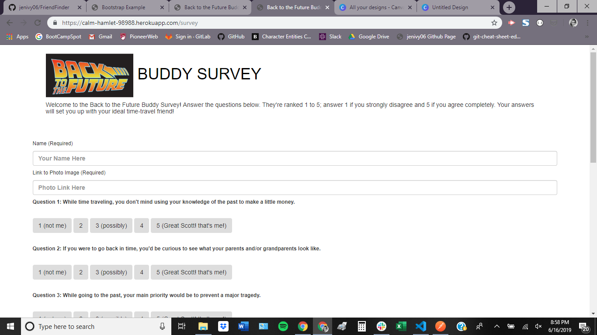

# Back to the Future Buddy Finder

###### About this app:

Fire up your flux capacitor! You're going to travel through time with one of the buddies below (or maybe a mystery person!) But who will it be? Take the survey to find out! Questions are ranked 1 to 5; users will answer 1 if they strongly disagree and 5 if they agree completely. Their answers will set them up with their ideal time-travel friend!

###### Code explanation:

A server.js file sets up the Express server, specifying a port number, the npm packages that need to be loaded, and also the routes, which we have externalized.

There are 2 separate HTML files (home.html and survey.html) that serve as the front-end portion of the code.

2 routing files (htmlRoutes.js and apiRoutes.js) determine the back-end logic (based on the request being made, the response that gets sent to the browser); the HTML routes display the survey and the homepage based on the URL that is accessed, and the API routes send back existing content in the server-side data or add new friends

Best match is calculated by finding the friend with the minimal difference in scores and then sending that friend to the browser as a JSON object

A modal is then toggled, displaying the the best match to the person who just took the survey

###### Technologies used:

JavaScript
jQuery
node.js
Express.js
HTML
Bootstrap